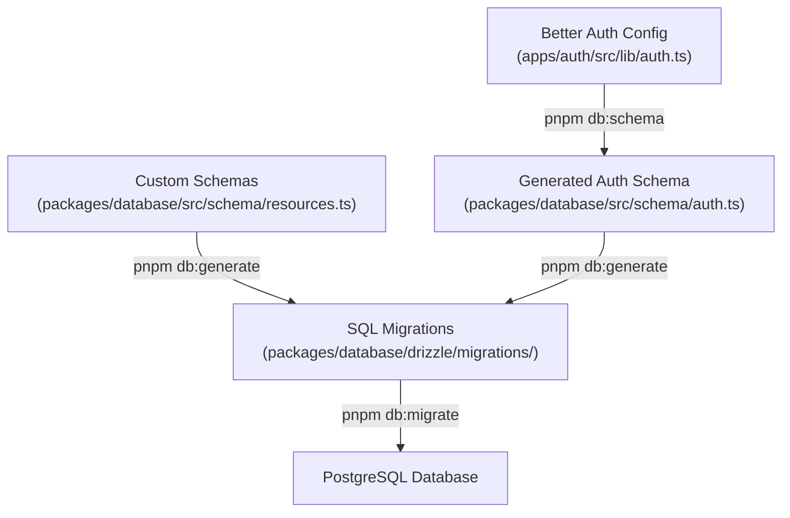

This project uses a structured approach to database schema management that combines **auto-generated schemas** from authentication configuration with **manually defined schemas** for application data. This hybrid approach ensures type safety, maintainability, and flexibility.

## Overview

The database schema is managed through two complementary sources:

1. **Authentication Schemas**: Automatically generated from Better Auth configuration
2. **Application Schemas**: Manually defined schemas for your custom data models

## Architecture

The schema management workflow looks like this:



## Workflow

### Adding Authentication Features

When you modify authentication settings:

```bash
# 1. Update Better Auth configuration
# Edit apps/auth/src/lib/auth.ts to add fields, plugins, etc.

# 2. Generate updated auth schema
pnpm db:schema

# 3. Generate and apply migration
pnpm db:generate && pnpm db:migrate
```

### Adding Custom Data Models

When you need new tables for your application:

```typescript
// Edit packages/database/src/schema/resources.ts
export const posts = table("posts", {
  id: serial("id").primaryKey(),
  title: text("title").notNull(),
  content: text("content"),
  authorId: text("author_id").references(() => users.id),
  createdAt: timestamp("created_at").defaultNow(),
});

// Export from index.ts
export * from "./resources";
```

```bash
# Generate and apply migration
pnpm db:generate && pnpm db:migrate
```

## Benefits

* **Type Safety**: Full TypeScript types generated for all schemas
* **Zero Boilerplate**: Auth schemas generated automatically
* **Version Control**: All schema changes tracked in Git
* **Migration Safety**: Drizzle ensures safe, reversible migrations
* **Flexibility**: Add custom tables without touching auth logic

## Best Practices

* Always review generated SQL before applying migrations
* Test migrations on a copy of production data first
* Use descriptive names for custom tables and columns
* Keep authentication and application schemas logically separated
* Commit schema changes and migrations together

## Complete Setup

For new projects, set up the database with:

```bash
pnpm db:setup  # Generates auth schema, creates migrations, and applies them
```
